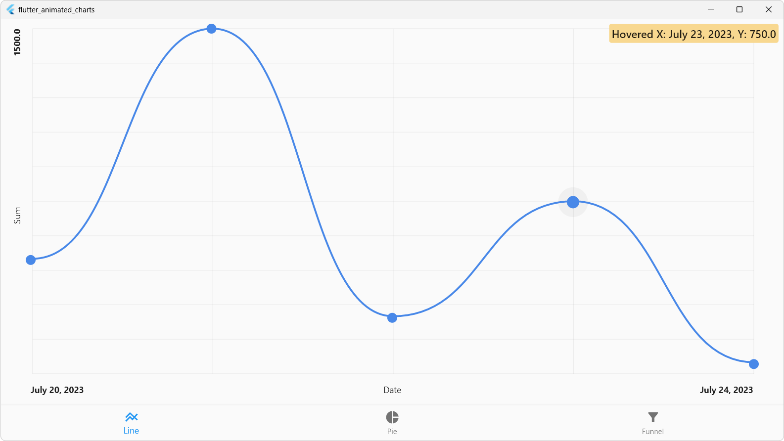
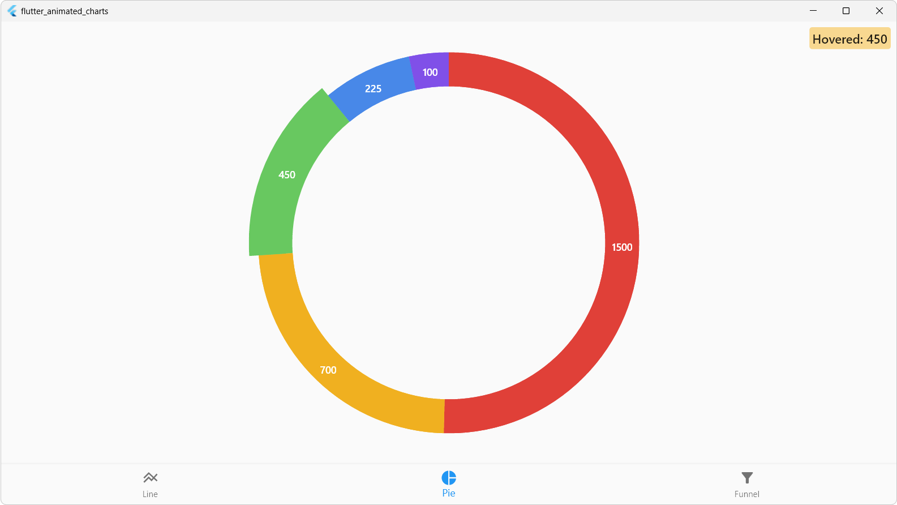
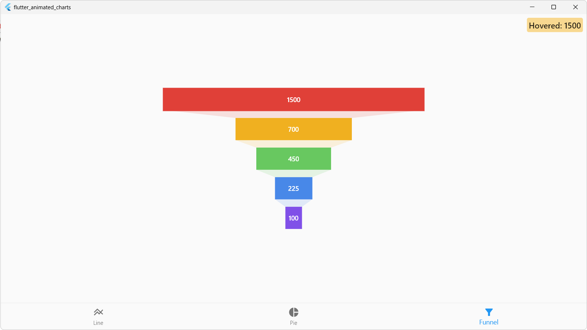

# Flutter Animated and Interactive Charts

This is a demo application for the “Flutter Animated and Interactive Charts” post on the
[Dmitry Sikorsky’s blog](https://medium.com/@dmitrysikorsky). It demonstrates how easy it is to create charts on Flutter.

## Sample Screenshots

*Line chart*

*Pie chart*

*Funnel chart*

## Links

Author: http://sikorsky.pro/